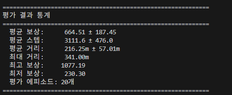

# 무지랭이의 강화학습 공부

> [무지랭이 유튜브 설명 영상 바로가기](https://www.youtube.com/REPLACE_ME)

## 학습 내용
1. **study1** - CartPole 학습 시켜보기 (CPU 가능)
2. **study2** - Breakout 학습 시켜보기 (GPU)
3. **study3** - 나만의 게임(황새 오래 걷기) 학습 시켜보기 (GPU)


## 시작하기

**0. NVIDIA 그래픽 드라이버 업데이트** (GPU 학습 시 필요)

CUDA가 정상 동작하려면 NVIDIA 드라이버가 최신 버전이어야 합니다.
https://www.nvidia.com/drivers 에서 본인 GPU에 맞는 최신 드라이버를 설치하세요.

**1. 가상환경 생성 및 활성화**
```bash
conda create -n rl_study python=3.12
conda activate rl_study
```

**2. PyTorch 설치**

https://pytorch.org/ 에서 본인 환경에 맞는 설치 명령어를 확인하세요.

```bash
# 예시 (CUDA 12.8)
pip install torch torchvision --index-url https://download.pytorch.org/whl/cu128
```

**3. 패키지 설치**
```bash
pip install -r requirements.txt
```

**4. Atari ROM 설치** (study2 Breakout에 필요)
```bash
pip install autorom[accept-rom-license]
AutoROM --accept-license
```


## study3: 황새 오래 걷기 (Walk the Stork)

Chrome 브라우저의 Flash 게임 "황새 오래 걷기"를 화면 캡처 + 키보드 제어로 플레이하는 강화학습 환경입니다.

### Pretrained 모델 다운로드

학습 없이 바로 테스트하고 싶다면, 아래 링크에서 사전학습된 모델을 다운로드할 수 있습니다.

[Pretrained 모델 다운로드 (Google Drive)](https://drive.google.com/file/d/1KPIMaLtfC_jlLXgdF1sQbcWeuiejRMrQ/view?usp=sharing)

다운로드한 `.zip` 파일을 프로젝트 루트 또는 원하는 경로에 배치한 후, `study3/test.py`의 `TEST_MODEL_PATH`에 해당 경로를 설정하세요.

```python
# study3/test.py
TEST_MODEL_PATH = r"MJRI_ppo_bestmodel.zip"  # 다운로드한 모델 경로
```

### 실행 방법

```bash
# 1. Chrome에서 '황새 오래 걷기' 게임을 먼저 실행합니다.

# 2-A. 처음부터 학습하려면:
python study3/train.py

# 2-B. Pretrained 모델로 바로 테스트하려면:
python study3/test.py
```

### 테스트 결과
테스트 결과 유튜브 기준 사람의 최고 기록( 256M )보다 성능이 더 잘 나오는 것을 확인할 수 있습니다.



### study1/2와의 차이점

| | study1/2 | study3 |
|---|---|---|
| **환경** | Gymnasium 가상환경 (여러 개 생성 가능) | 실제 게임 환경 (1개만 가능) |
| **학습 방식** | 표준 PPO (n_steps마다 즉시 학습) | 에피소드 경계 PPO (게임 한 판이 끝난 후 학습) |
| **train/test** | 동시 실행 가능 | 순차 실행 (train 완료 후 test) |
